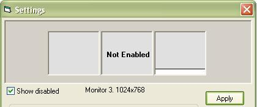



## Dual Monitor Support

### Description

This class adds dual monitor support to your apps, supporting any number of monitors, weather they are different screen resolutions or have been moved around in the display properties. I had tried many other methods, but they didnt work at all (microsofts example), or they didnt with different screen resolutions. This one does!!
 
### More Info
 

             |
---                |---
**Submitted On**   |2005-02-17 15:12:10
**By**             |[Darren Scales](https://github.com/Planet-Source-Code/PSCIndex/blob/master/ByAuthor/darren-scales.md)
**Level**          |Intermediate
**User Rating**    |4.6 (46 globes from 10 users)
**Compatibility**  |VB 5\.0, VB 6\.0
**Category**       |[VB function enhancement](https://github.com/Planet-Source-Code/PSCIndex/blob/master/ByCategory/vb-function-enhancement__1-25.md)
**World**          |[Visual Basic](https://github.com/Planet-Source-Code/PSCIndex/blob/master/ByWorld/visual-basic.md)
**Archive File**   |[Dual\_Monit1854042172005\.zip](https://github.com/Planet-Source-Code/darren-scales-dual-monitor-support__1-58969/archive/master.zip)

